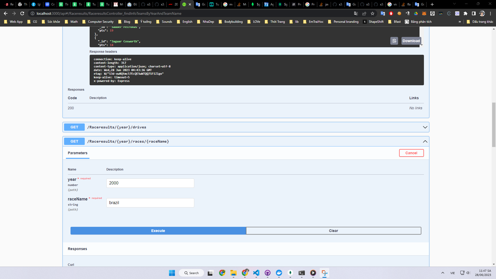

# vrillar-f1

# Project overview

The project has two folders

_crawling-f1_: Directory containing crawl data tool. In this part I used the tabletojson library. If the project is real I will create a fork but here I have intervened to modify the code of the library to suit the needs. So I included this module in the commit.

_nest-f1_: Api server created with nestJS

# Running projects

Node and mongodb required.

## Run mongodb

I use docker to run mongodb. Check out docker-compose.yml at

_\vrillar-f1\crawling-f1\docker-compose.yml_

Note that the mongodb address mongodb://127.0.0.1:27017 has been hardcoded.

## Run crawling-f1

Install module and compile typescript

```javascript
cd crawling-f1
npm install
npx tsc
```

The crawl process consists of creating a Job saved to the database to check the status and step two executing and updating the completed status.
There are two tables of data to be crawled in sequential order.

In folder crawling-f1

Create Job

```bash
node .\dist\src\createDataRacesJob.js
```
Run Job

```bash
node .\dist\src\crawRacesInfo.js
```

If you see the message _all Done_, the job is done

Do the next job

In folder crawling-f1

Create Job

```bash
node .\dist\src\createDataRacesResultJob.js
```
Run Job

```bash
node .\dist\src\crawRacesResult.js
```

If you see the message _all Done_, the job is done

Checking the data in the database will have document _raceresults_. That is the data we need to analyze and retrieve using the API.
I have exported it to a json file: _vrillar-f1\nest-f1\nest-f1.rayceresults.json_


## Run server API

```javascript
cd nest-f1
npm install
npm start
```

Open http://localhost:3000/api#/ Swagger interface can easily interact with API.


# API info

## /Raceresults/{year}/races
Overview of race results by year

## /Raceresults/{year}/drives
Overview of racing results by year

## /Raceresults/{year}/teams
Overview of racing teams by year

## /Raceresults/{year}/races/{raceName}

Detailed results information by year by race name.

Race name can be obtained from api _/Raceresults/{year}/races_

## /Raceresults/{year}/drives/{deriveName}

Detailed results information by year by derive name.

Derive name can be obtained from api _/Raceresults/{year}/drives_

## /Raceresults/{year}/teams/{teamName}

Detailed results information by year by teamName.

Team name can be obtained from api _/Raceresults/{year}/teams_

## /Raceresults/{year}/rank/{teamName}

Returns a team's rank by year.

# Result video

[](./Demo.mp4)
